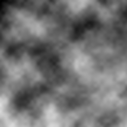

latticenoise
============

A small C library and executable for generating procedural textures.

Current Status
--------------

There are functions for creating and destroying a lattice, and retrieving raw values
from it in 1D, 2D and 3D.

Currently has support for:

    - General perlin noise lookups in 1D and 2D.
    - Fractal sum methods for 1D and 2D.
    - Catmull-Rom or Hermite interpolation (through compiler define atm.)
    - Custom random number generators.
    - A simple standalone program for generating noise images.

About the code
-------------

The code is standard complaint C99 code.

Documentation
-------------

### Creating and destroying the lattice

The main object in the library is the "lattice". For simplicity the lattice is
always square (or cubic/hypercubic), meaning, it has the same amount of elements
in all directions regardless of dimensionality.

It is called a lattice because in essence it is a n-dimensional grid filled with 
pseudorandom floating point numbers. For a dimensionality of two it is equivalent 
to a square matrix.

A non-uniform grid can always be simulated by sampling the grid in a non-uniform
space.

To create a lattice you call:
```c
extern ln_lattice ln_lattice_new(
	unsigned int dimensions, 
	unsigned int dim_length, 
	ln_rng_func_def *rng_func);
```

`dimensions` of course specify the dimensionality of the lattice, whether it has
only one, two or n-dimensions. `dim_length` is the amount of elements or the 
"size" of the lattice in each direction. The amount of elements in the lattice 
is thus dim_length raised to dimensions.

Usually you don't need a very large lattice because detail can be created with
layering and other tricks.

`rng_func` is a structure specifying a random number generator callback. If NULL
is passed, the default C `rand` function is used.

When you are done with the lattice you destroy it with:
```c
void ln_lattice_free(ln_lattice lattice);
``` 

### Sampling the lattice

The way perlin noise and similar method works is simply by pulling values from
this lattice using floating point coordinates, taking care to interpolate them
appropriately. This creates smooth noise even though the lattice is inherently
discrete.

You can access the individual values directly, but that is seldom what you want.
You want the interpolated value and methods are provided for that purpose.

Another feature with the following methods is that they wrap around, creating 
an infinitely repeating grid. You won't ever need to worry about x causing a
buffer overrun.

To sample a 1D lattice you call:
```c
extern float ln_lattice_noise1d(ln_lattice lattice, float x);
```

The 2D version just requires an additional coordinate:
```c
extern float ln_lattice_noise2d(ln_lattice lattice, float x, float y);
``` 

These two methods result in what is usually called perlin noise. 

### Sampling with fractal noise

TBD.

### Simple 1D noise
```c
// Use a size 64 lattice for noise lookups with default PRNG.
ln_lattice lattice = ln_lattice_new(1, 64, NULL);
// Sample the middle of the lattice with cubic interpolation.
float v = ln_lattice_noise1d(lattice, 0.5f * 64.0f);
// Cleanup. 
ln_lattice_free(lattice);
```

### 2D Fractal Noise
```c
ln_lattice lattice = ln_lattice_new(2, 64, NULL);

ln_fsum_options fsum_opts = ln_default_fsum_options();

/*
    Calculates a fractal noise sum and normalizes it with the analytically derived
    maximum value.
    
    This way v will always be between [0.0, 1.0].
*/
float norm = 1.0f / ln_fsum_max_value(&fsum_opts);
float v = ln_lattice_fsum2d(lattice, x, y, &fsum_opts) * norm;

ln_lattice_free(lattice);
```

An example of some "fbm" type noise generated with the default settings for
ln_lattice_fsum2d.



License
-------

The main library is under a BSD License. For more information, check each 
individual file.

stbi_image.h and parg is used by the mknoise executable. They are not used by 
latticenoise.h and latticenoise.c.
